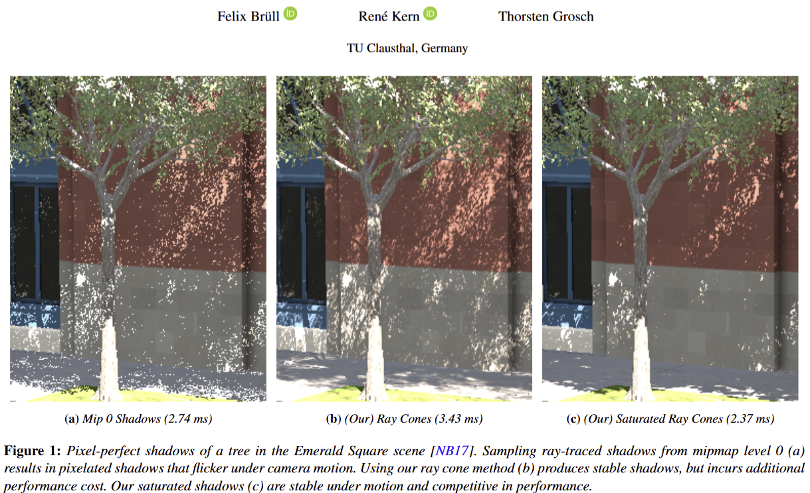

# Real-Time Motion Vectors after Multiple Refractions

Demo Video (DLSS):

Intel XeSS 2.0 and AMD FSR 3.1 variant:

## Contents:

* [Demo User Interface](#demo-user-interface)
* [Source Code](#source-code)
* [Falcor Prerequisites](#falcor-prerequisites)
* [Building Falcor](#building-falcor)

## Demo User Interface

This project was implemented in NVIDIAs Falcor rendering framework.

You can download the executable demo from the [Releases Page](https://github.com/kopaka1822/Falcor/releases/tag/Refraction), or build the project by following the instructions in [Building Falcor](#building-falcor).

After downloading the demo from the releases page, you can execute it with the RunFalcor.bat file. In the Demo, you can configure the renderer after expanding the **GlassTracer** tab. In the **GlassTracer** tab you can configure the Whitted Ray Tracer:
* Render Scale: By default, we render the image on 1/3 resolution. Use this dropdown to change the render resolution for DLSS
* Motion Vector: Technique used for the primary motion vector estimate. You can set this to FirstHit for classical first-hit motion vectors
* Force Motion Vector Calculation: By default we set motion vectors to zero if nothing moved between frames. Enabling this option will always calculate motion vectors (Note that we use a camera jitter, so the image does jitter from frame to frame)
* Optical Flow Technique: By default we use our positional Lucas-Kanade algorithm, but you can set this to None to disable any post-processing on the motion vectors
* Iterations: Iterations for the Lucas-Kanade algorithm
* Bilateral Blur: Radius in pixels for our bilateral filter. Set this to 0 to disable bilateral filtering.
Other interesting settings:
* Pathtracer group: After expanding this group, you can modify the maximum path length of stack size of the whitted ray tracer. You can also enable hits after TIR, or hits from the non-primary path.
* OutputSwitch: Here you can change the TAA method from DLSS to Intel XeSS or AMD FSR 3.

You can navigate the camera with WASD and dragging the mouse for rotation.
Hold shift for more camera speed
QE for camera up and down
Space to pause the animation

## Source Code

The important files can be found in `Source/RenderPasses/GlassTracer/`:
* `GlassTracer.cpp/.h`: Whitted Ray Tracer
* `GlassTracer.rt.slang`: Shader code for the Whitted Ray Tracer
* `OpticalFlowPos.cs.slang`: Compute Shader for our positional Lucas-Kanade implementation
* `OpticalFlowBlur.cs.slang`: Compute Shader for our bilateral filter

## Falcor Prerequisites
- Windows 10 version 20H2 (October 2020 Update) or newer, OS build revision .789 or newer
- Visual Studio 2022
- [Windows 10 SDK (10.0.19041.0) for Windows 10, version 2004](https://developer.microsoft.com/en-us/windows/downloads/windows-10-sdk/)
- A GPU which supports DirectX Raytracing, such as the NVIDIA Titan V or GeForce RTX
- NVIDIA driver 466.11 or newer

Optional:
- Windows 10 Graphics Tools. To run DirectX 12 applications with the debug layer enabled, you must install this. There are two ways to install it:
    - Click the Windows button and type `Optional Features`, in the window that opens click `Add a feature` and select `Graphics Tools`.
    - Download an offline package from [here](https://docs.microsoft.com/en-us/windows-hardware/test/hlk/windows-hardware-lab-kit#supplemental-content-for-graphics-media-and-mean-time-between-failures-mtbf-tests). Choose a ZIP file that matches the OS version you are using (not the SDK version used for building Falcor). The ZIP includes a document which explains how to install the graphics tools.
- NVAPI, CUDA, OptiX

## Building Falcor
Falcor uses the [CMake](https://cmake.org) build system. Additional information on how to use Falcor with CMake is available in the [CMake](docs/development/cmake.md) development documentation page.

### Visual Studio
If you are working with Visual Studio 2022, you can setup a native Visual Studio solution by running `setup_vs2022.bat` after cloning this repository. The solution files are written to `build/windows-vs2022` and the binary output is located in `build/windows-vs2022/bin`.
